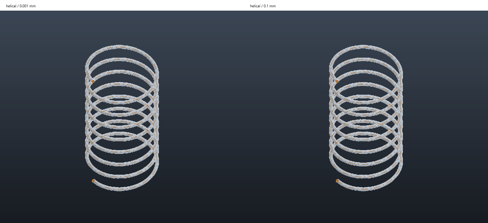

# Sweep approximation precision study

The initial experiment changed test inputs only. Its results informed the
subsequently approved per-feature controls and separate factory defaults below.
No user documents were modified by the experiment.

## Question and controls

Inputs are identical 2D, 3D, and helical sweep definitions at linear tolerances
of 0.001 mm and 0.1 mm. The requested outputs are calculation time, geometric
change, and appearance at the same display quality. The means are the current
native document preparation, OCCT kernel, and real OpenGL viewer.

The document previously supplied 0.001 mm as the sweep linear tolerance and
0.1 mm as the default mesh deflection. These settings have different meanings.
The experiment holds mesh deflection at 0.1 mm and final Boolean tolerance at
0.001 mm to isolate sweep approximation from downstream Boolean tolerance.
Changing the existing document-wide linear tolerance would affect both.

## Measured results

Mean kernel times from three measured runs (one warm-up excluded):

| Fixture | 0.001 mm | 0.1 mm | Speedup | Largest sampled difference | Volume change |
| --- | ---: | ---: | ---: | ---: | ---: |
| 2D bend | 314 ms | 292 ms | 1.08× | 0.01009 mm | −0.02784% |
| 3D rounded route | 747 ms | 713 ms | 1.05× | 0.00214 mm | −0.00626% |
| Eight-turn helix | 261,383 ms | 6,567 ms | 39.8× | 0.00254 mm | −0.00288% |

All measured BReps passed validity checks. The sampled differences are not
certified maximum deviations. At the tested camera/mesh quality the helical
images show no substantial visible change. This is evidence for the tested
spring, not a precision guarantee for every profile or downstream operation.
Raw values are in [the JSON report](SWEEP_PRECISION_20260926.json).



### Follow-up: 0.5 mm

The same eight-turn fixture was retried with 0.1 and 0.5 mm. The 0.1 mm warm-up
took 6362 ms. The 0.5 mm warm-up did not complete after more than 120 seconds
and was interrupted before a result was available. No validity, shape-error or
speedup claim is made for 0.5 mm. Relaxing a kernel tolerance is not guaranteed
to reduce calculation time. This observation supports keeping 0.1 mm as the
H-Sweep factory default; users can still choose 0.5 mm for their own models.

## Product behavior

2D and 3D Sweep retain 0.001 mm defaults. Helical Sweep uses 0.1 mm. All three
Properties windows offer **Custom precision** and an approximation tolerance
in mm. The setting changes calculated geometry; STEP import's mesh deflection
instead changes display tessellation while retaining imported exact geometry.

`config/config.ini` has separate `SweepPrecision/Sweep2D`, `Sweep3D`, and
`HelicalSweep` keys. GUI and CLI use the same configuration layers. Creation
copies the current configured default into the native feature. Turning custom
precision off returns to that saved default, so changing configuration cannot
silently alter existing features. The explicit custom value, default snapshot,
and checkbox state persist in the native document. Final document Boolean
tolerance and display mesh deflection remain separate controls.

Additional command fixtures found a numerical self-contact in the relaxed
two-turn pipe result. Transported sweeps now retry surface construction once
at 0.001 mm if the coarse result fails the self-intersection check. The same
authored path and source identities are retained, and the refined result must
pass the same check. The requested tolerance is an upper approximation allowance,
not a requirement to introduce that much error. This retry can make individual
models slower; genuine self-intersections remain errors.

CLI `sweep2d`, `sweep3d`, and `helical` create/set accept `precision_mm` and
`custom_precision`; get returns these and `default_precision_mm`. Setting
`precision_mm` enables the override unless `custom_precision=false` is also
explicitly supplied. Valid tolerances range from 1e-9 to 1e6 mm.

The benchmark uses a Release build, a fresh kernel for every calculation, one
warm-up pair, and three measured pairs in alternating order. Preparation and
complete kernel calculation are measured separately. Kernel time includes
solid construction, validity checks, display meshing, and reference packets.
It is not the total Properties-to-OK latency and does not identify which
internal kernel stage dominates. No build or other verification workload is
run concurrently with the measurements.

The synthetic fixtures are a 2D circular bend with a 2 mm radius profile,
a spatial route with two rounded corners and a 2 mm radius profile, and an
eight-turn spring with 10 mm centerline radius, 5 mm pitch, and 0.5 mm wire
radius. They do not establish performance on every user model, variable-section
loft, Thin sweep, or subtractive machining operation.

## Geometry and visual checks

Each resulting BRep is checked for validity. Bidirectional distances sample
surface vertices against the other exact trimmed BRep, rather than comparing
two coarse display meshes. Reported maxima are sampled differences from the
0.001 mm result, not certified global error bounds or distances from an exact
design surface. Volume and surface area provide independent checks.

Side-by-side images use the real viewer with identical camera settings and
mesh deflection. A visually similar result does not establish machining
accuracy, especially when the feature becomes a Boolean cutting tool.

The helical path has an independent maximum angular interval of 1/16 turn.
Increasing linear tolerance therefore need not reduce its path-segment count;
it also changes the tolerances passed to the pipe surface builder.

## Reproduction

Build `zima_cpp_sweep_precision_benchmark` and run from the repository root:

```powershell
build/cpp-windows-release/zima_cpp_sweep_precision_benchmark.exe build/sweep-precision-20260926
# Optional follow-up: only H-Sweep, 0.1 mm against 0.5 mm
build/cpp-windows-release/zima_cpp_sweep_precision_benchmark.exe build/sweep-precision-05 0.1 0.5 helical
```

The executable writes `report.json` and one comparison PNG per fixture to that
output directory. It is a diagnostic executable, not part of the product UI.
