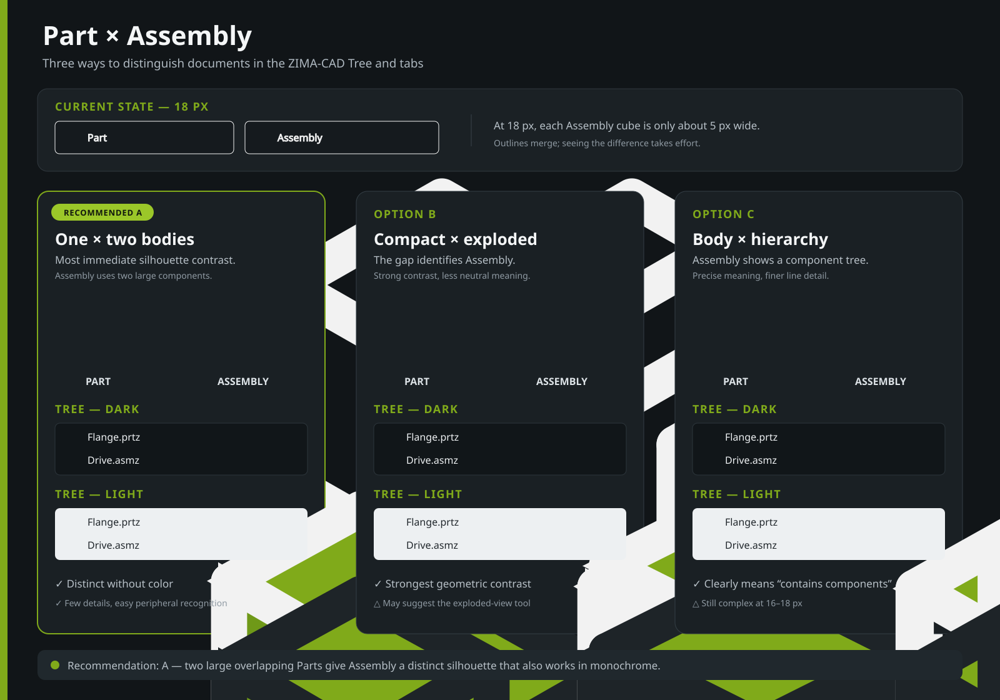
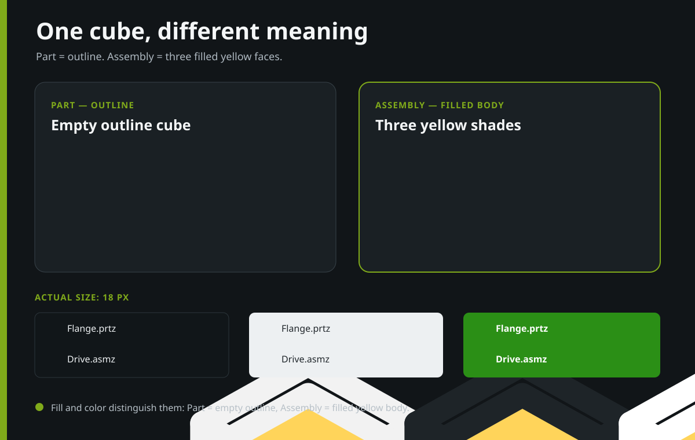

# Part / Assembly icon proposals

The English SVG boards are the maintained proposal sources. Obsolete raster
previews with superseded Czech captions were removed; Git retains them.

## Recommendation

Use variant A:

- Part has one large closed body silhouette.
- Assembly has two large overlapping bodies.
- The distinction remains readable at 18 px in dark/light themes without relying only on color.
- The concept follows the information hierarchy of the Pro/E reference in
  `doc/01.png`, while retaining ZIMA-CAD's line style and green accent.

Recommended standalone prototypes are `part-a.svg` and `assembly-a.svg`.
They are not connected to the application yet.

## Color variant

> Historical note: the empty Part icon described here was later replaced by
> a blue-filled cube in `resources/icons/part.svg`. This directory preserves
> design iterations, not the current authoritative icon set.

The second design round produced a simpler pair sharing one silhouette:

- Part is an empty outlined cube without color fill.
- Assembly has all three faces filled with shades of yellow, distinguishing
  solid mass from a mostly empty outline rather than relying on color alone.

This direction removes tiny Assembly cubes and is very distinct at 18 px.
Part remains an empty outline; Assembly is a solid yellow mass. The three
faces have different brightness so their spatial orientation remains readable.

The standalone prototype is `assembly-color.svg`.
