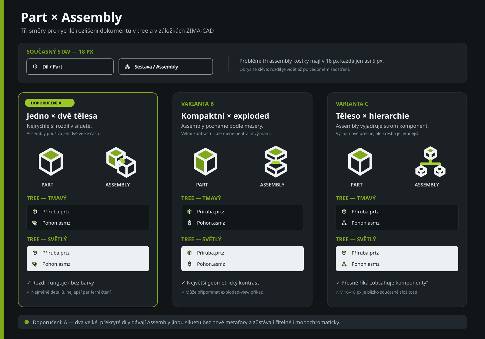
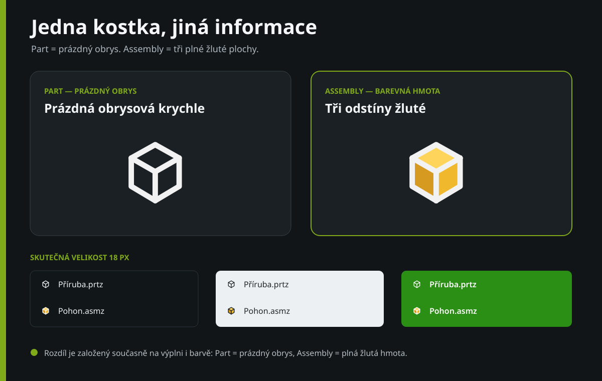

# Návrhy ikon Part / Assembly

## Doporučení

Použít variantu A:

- Part má jednu velkou, uzavřenou siluetu tělesa.
- Assembly má dvě velká překrytá tělesa.
- Rozdíl zůstává čitelný při 18 px, v tmavém i světlém motivu a také bez
  spoléhání pouze na barvu.
- Princip odpovídá informační logice reference Pro/E v `doc/01.png`, ale
  kresba zachovává linkový styl a zelený akcent ZIMA-CAD.

Samostatné prototypy doporučené varianty jsou `part-a.svg` a
`assembly-a.svg`. Nejsou zatím zapojené do aplikace.

## Barevná varianta

Po druhém návrhovém kole vznikla jednodušší dvojice se shodnou siluetou:

- Part je prázdná obrysová krychle bez barevné výplně.
- Assembly má všechny tři plochy vyplněné odstíny žluté. Proti Partu tak
  nepůsobí jen jinou barvou, ale jako plná hmota proti převážně prázdnému
  obrysu.

Tento směr odstraňuje drobné assembly kostky a je při 18 px velmi výrazný.
Rozdíl nestojí jen na barvě: Part je prázdný obrys, zatímco Assembly je plná
žlutá hmota. Tři žluté plochy mají rozdílný jas, aby zůstala čitelná i jejich
prostorová orientace.

Samostatný prototyp je `assembly-color.svg`.
